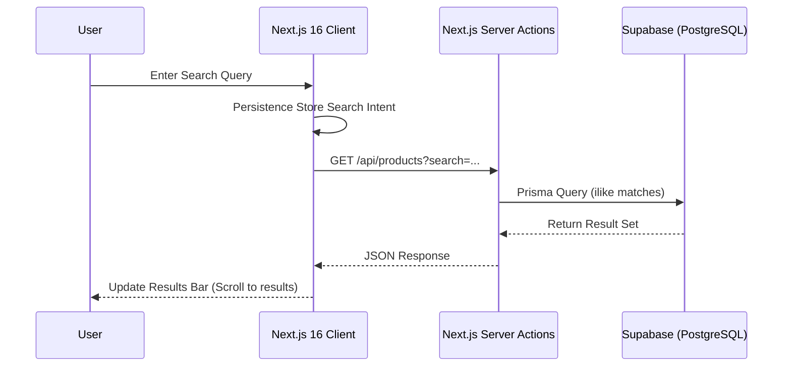
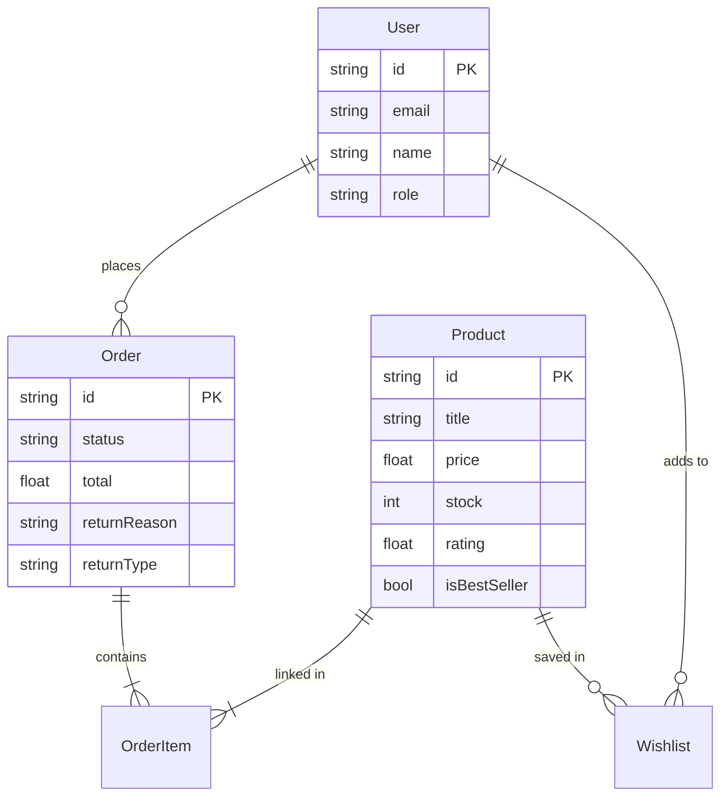

# Amazon - Yashita Clone (Production Edition)

Welcome to the most advanced Amazon storefront clone, built with **Next.js 16**, **Tailwind CSS 4**, and **Prisma/Supabase**. This project is a high-fidelity demonstration of modern e-commerce UX, featuring deep search, personalized recommendations, and a robust logistics/return system.

---

## 🚀 Key Features

### 🔐 Advanced Authentication
- **OTP-Based Verification**: Secure login flow with simulated OTP generation and timing logic.
- **Demo Mode**: Instant access with a "Demo User" profile for immediate exploration.
- **Session Persistence**: Persistent user state across page reloads and browser sessions.

### 🛒 Immersive Shopping UX
- **Amazon-Grade Home Page**: Dynamic 2x2 category grids overlapping a responsive, auto-sliding carousel.
- **Smart Product Recovery**: "Buy it Again" functionality integrated directly into order history and return views.
- **High-Fidelity PDP**: Product Detail Pages featuring color/size swatches (non-image based), EMI calculators, and bank offer highlights.

### 🔍 Discovery & Personalization
- **Intent-Driven Recommendations**: "Inspired by your search" cards that dynamically update based on recent user search history stored in localized state.
- **Deep Search**: Backend-powered multi-field searching across titles, categories, and descriptions.
- **Dynamic Filters**: Real-time sorting (price, rating, newest) and metadata filtering (Best Sellers, Limited Time Deals).

### 📦 Order & Logistics
- **Tracking System**: Visual progress bar for order lifecycle (Ordered → Shipped → Out for Delivery → Delivered).
- **Return & Exchange**: Fully functional request system with status persistence and reason tracking.
- **Mailing Integration**: Automated purchase confirmation emails with Amazon-styled templates.

---

## 🏗️ System Architecture



---

## 📊 Database Schema

Our database is hosted on **Supabase** and managed via **Prisma ORM**. Below is the core architecture:

### Model Overview


### Table Definitions

| Table | Purpose | Key Fields |
| :--- | :--- | :--- |
| **Product** | Catalog storage | `imageUrl`, `discountPercentage`, `isLimitedTimeDeal` |
| **Order** | Transaction tracking | `status`, `address`, `returnReason`, `returnType` |
| **OrderItem** | Line items for orders | `quantity`, `unitPrice` |
| **User** | Identity management | `email`, `emailVerified` |
| **Wishlist** | Private save-for-later | `userId`, `productId` |

---

## 🛠️ Technology Stack

| Layer | Technology |
| :--- | :--- |
| **Framework** | Next.js 16.2.3 (App Router + Turbopack) |
| **Language** | TypeScript (Strict Mode) |
| **Styling** | Tailwind CSS 4.0 (Neo-Amazon Design System) |
| **Animations** | Framer Motion (Slide-overs & Fade-ins) |
| **Database** | Prisma + PostgreSQL (Supabase) |
| **Emails** | Nodemailer (AWS/Gmail ready) |

---

## 📦 Getting Started

1. **Install Dependencies**:
   ```bash
   npm install
   ```

2. **Environment Setup**:
   Create a `.env` file with your `DATABASE_URL` and `DIRECT_URL`.

3. **Database Migration**:
   ```bash
   npx prisma db push
   ```

4. **Launch Dev Server**:
   ```bash
   npm run dev
   ```

---

Built with ❤️ by Yashita
