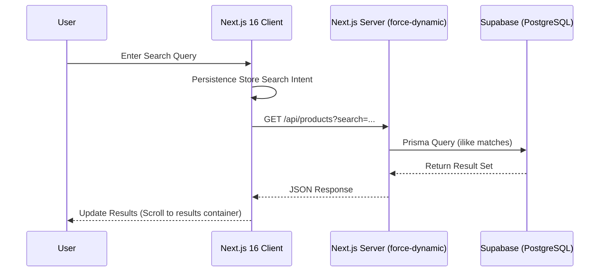
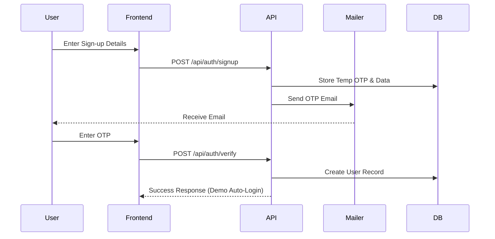
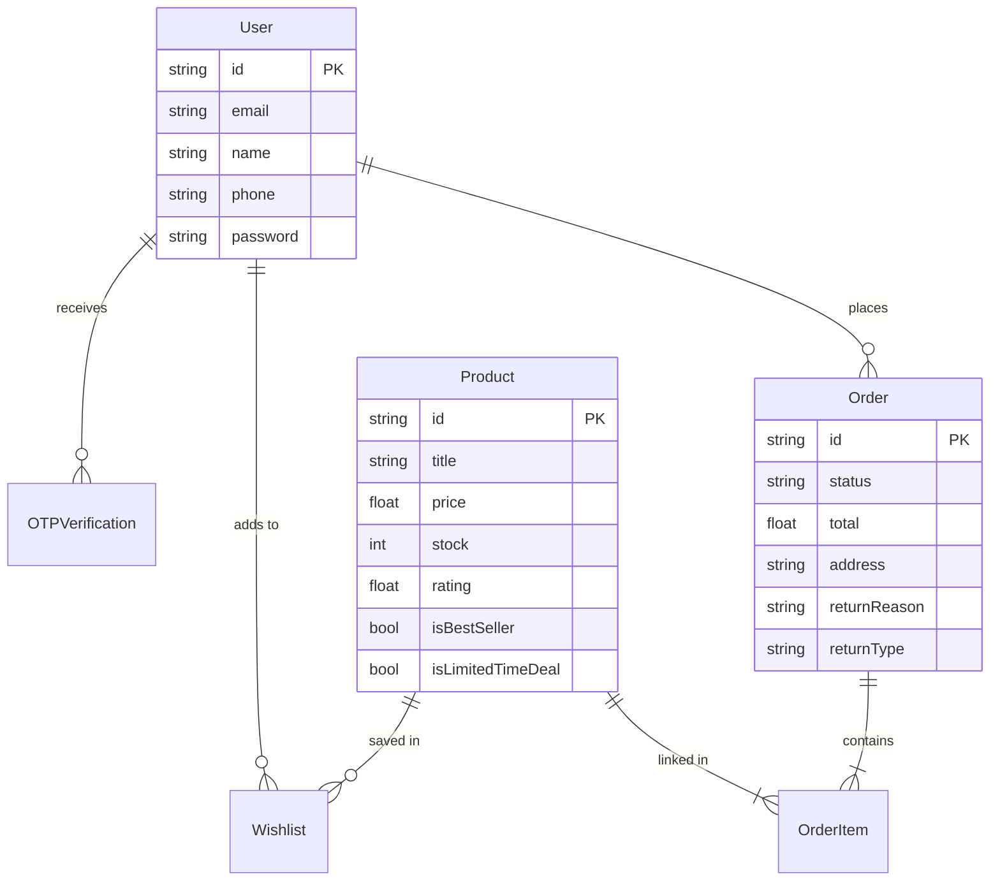

# Amazon - Yashita Clone (Production Edition)

Welcome to the most advanced Amazon storefront clone, built with **Next.js 16**, **Tailwind CSS 4**, and **Prisma/Supabase**. This project is a high-fidelity demonstration of modern e-commerce UX, featuring deep search, personalized recommendations, and a robust logistics/return system.

---

## 🚀 Key Features

### 👤 User Account & Profile
- **Personalized Dashboard**: A centralized hub for managing orders, login security, and Prime benefits.
- **Address Management**: Persistent address storage with visual map-based precise location selection.
- **Account Security**: Secure login flow with OTP-based verification and session persistence.

### 📍 Interactive Localization
- **Map-Based Location**: A high-fidelity location picker with simulated map pinpointing for "Approximate" or "Precise" geographic context.
- **Language Switcher**: Global UI language selection (EN, HI, TA, TE, KN) with demonstration-ready state management.

### 🛒 Immersive Shopping UX
- **Amazon-Grade Home Page**: Dynamic 2x2 category grids overlapping a responsive, auto-sliding carousel.
- **Smart Product Recovery**: "Buy it Again" functionality integrated directly into order history and individual item views.
- **High-Fidelity PDP**: Product Detail Pages featuring:
    - Text-based Color and Size swatches.
    - Detailed "Product Highlights" and metadata lists.
    - EMI calculators and real-time bank offer highlights.

### 🔍 Discovery & Personalization
- **Intent-Driven Recommendations**: "Inspired by your search" cards that dynamically update based on recent user search history.
- **Deep Search**: Backend-powered multi-field searching (Titles, Categories, Descriptions) with scroll-to-result anchors.
- **Dynamic Filters**: Real-time sorting (price, rating, newest) and metadata filtering (Best Sellers, Limited Time Deals).

### 📦 Logistics & Returns
- **Tracking System**: Visual progress bar for order lifecycle (Ordered → Shipped → Out for Delivery → Delivered).
- **Return & Exchange Request System**: Fully functional request flow with reason tracking and status persistence.
- **Mailing Integration**: Automated purchase confirmation and OTP emails with Amazon-styled templates.

---

## 🏗️ System Architecture

### Search & Intent Flow


### Authentication Flow


---

## 📊 Database Schema

Our database is hosted on **Supabase** and managed via **Prisma ORM**.

### Model Relationships


---

## 🗺️ Sitemap (Routes)

| Route | Purpose | Access |
| :--- | :--- | :--- |
| `/` | Interactive Home Page | Public |
| `/product/[id]` | Advanced Product Detail | Public |
| `/cart` | Shopping Basket | Public |
| `/checkout` | Secure Payment Flow | Protected |
| `/profile` | User Dashboard & Addresses | Protected |
| `/orders` | High-level Order History | Protected |
| `/orders/[id]` | Order Tracking & Returns | Protected |
| `/wishlist` | Saved Items List | Protected |
| `/signin` / `/signup` | Authentication Gateways | Public |

---

## 🔌 API Reference

| Endpoint | Method | Description |
| :--- | :--- | :--- |
| `/api/products` | GET | List products with search/filter support |
| `/api/orders` | POST | Create a new order (triggers email) |
| `/api/orders/list` | GET | Fetch orders for a specific user |
| `/api/orders/[id]` | GET | Fetch detailed order tracking data |
| `/api/orders/[id]/return` | POST | Submit return/exchange request |
| `/api/auth/signup` | POST | Initialize sign-up & send OTP |
| `/api/auth/verify` | POST | Verify OTP & create user |

---

## 🛠️ Technology Stack

| Layer | Technology |
| :--- | :--- |
| **Framework** | Next.js 16.2.3 (App Router + Turbopack) |
| **Styling** | Tailwind CSS 4.0 (Neo-Amazon Design System) |
| **Database** | Prisma + PostgreSQL (Supabase) |
| **Deployment** | Vercel Optimized (`force-dynamic` APIs) |
| **Environment** | Production-hardened via robust `.gitignore` |

---

## 📦 Production Setup

1. **Environment Config**:
   Create a `.env` in the root (Protected via gitignore):
   ```env
   DATABASE_URL="postgres://..."
   DIRECT_URL="postgres://..."
   EMAIL_USER="you@gmail.com"
   EMAIL_PASS="your-app-password"
   ```

2. **Database Initialization**:
   ```bash
   npx prisma generate
   npx prisma db push
   ```

3. **Build & Deploy**:
   The project is configured for Vercel with dynamic route segments handled via `export const dynamic = "force-dynamic"` in all API routes.

---

Built with ❤️ by Yashita
